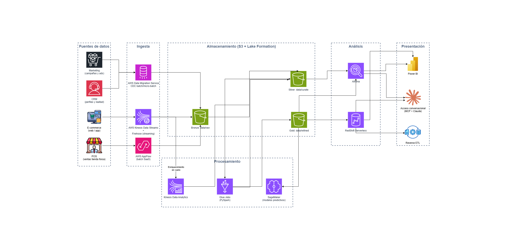

# 1. Diseño de Arquitectura de Datos (AWS)

## Preguntas a responder en este bloque

1.1. Describe cómo diseñarías una arquitectura de datos adecuada para esta
empresa. Incluye los componentes clave de la arquitectura, como fuentes de
datos, ingesta, almacenamiento, procesamiento, análisis y presentación.

1.2. Especifica qué tecnologías o lenguajes utilizarías en cada componente
del proceso.

## Enfoque general

Diseño la arquitectura siguiendo la metodología de IWCO (Exploración →
Extracción → Refinamiento → Consumo), implementada como un patrón ELT
(Extracción, Carga y Transformación) sobre un data lake con arquitectura
Medallion en AWS (Amazon Web Services): primero cargo el dato crudo en S3
(Simple Storage Service) tal cual llega de cada fuente, y luego lo
transformo dentro del lake en capas sucesivas (Bronze/Raw → Silver/Curated
→ Gold/Refined). Con este orden evito transformar antes de tener certeza
sobre la calidad y la forma real de los datos, y conservo el dato original
disponible para auditoría y reprocesamiento.

El punto con el que resuelvo la fragmentación descrita en el caso no es
una herramienta sino una decisión de diseño: genero un **`loyalty_id`**
como llave común entre POS, e-commerce, CRM y marketing en la capa
Silver. Con esa llave construyo, por primera vez, una vista única del
cliente a través de sus programas de lealtad online y offline.

## Diagrama de arquitectura

Versión editable en [`diagramas/01-arquitectura-datos-aws.drawio`](diagramas/01-arquitectura-datos-aws.drawio).

## 1.1. Componentes clave

### Fuentes de datos

| Fuente | Naturaleza | Patrón de acceso |
|---|---|---|
| POS | Base de datos transaccional (típicamente SQL Server/Oracle en el proveedor de POS) | CDC, Change Data Capture (cambios frecuentes durante horario de tienda) |
| E-commerce | Aplicación web o app, con base de datos transaccional y eventos de navegación (clickstream) | Streaming (alto volumen, picos en campañas) |
| CRM | Plataforma SaaS, Software as a Service, con perfiles de cliente y programa de lealtad | Batch/API (actualizaciones periódicas) |
| Marketing | Plataformas SaaS de campañas y pauta (ads, email) | Batch/API (reportes y métricas periódicas) |

### Ingesta

Uso un servicio distinto por fuente porque cada una tiene una naturaleza
de acceso distinta, no hay un único conector que sirva bien a los cuatro.

- **AWS AppFlow.** Servicio de AWS que conecta de forma nativa con
  plataformas SaaS, sin infraestructura propia que mantener. Lo elegí
  para CRM y Marketing porque ambas son plataformas SaaS con APIs
  estándar y AppFlow ya trae conectores prediseñados para las más
  comunes del mercado.

  - Segunda opción: si la herramienta puntual del cliente no tiene
    conector nativo en AppFlow, construyo una integración a medida con
    AWS Lambda contra la API de esa herramienta, o uso un iPaaS,
    Integration Platform as a Service, externo como Fivetran. Punto a
    validar con el cliente: confirmar qué CRM y qué plataformas de
    marketing usa exactamente, para verificar de una vez la
    disponibilidad de conector nativo.

- **AWS DMS (Data Migration Service).** Servicio de AWS que replica los
  cambios de una base de datos hacia otro destino mediante CDC (Change
  Data Capture), leyendo el registro de transacciones sin ejecutar
  consultas pesadas repetidas contra la base. Lo elegí para POS porque
  el backend de un sistema de punto de venta suele ser una base de datos
  relacional de tipo OLTP, procesamiento transaccional en línea, que no
  puede verse afectada en su rendimiento durante el horario de tienda.

  - Segunda opción: un Glue Job con conexión JDBC, Java Database
    Connectivity, en modo batch programado; es más simple de construir,
    pero implica consultas de extracción completas o por rango de fecha
    contra la base operativa y mayor latencia, por lo que solo lo
    usaría si el volumen de POS es bajo y no se requiere una latencia
    cercana al tiempo real. Punto a validar con el cliente: qué motor de
    base de datos usa cada proveedor de POS y si permite acceso a su
    registro de transacciones (binlog o redo log), de eso depende poder
    usar DMS directamente.

- **Amazon Kinesis (Data Streams y Firehose).** Familia de servicios de
  AWS para capturar y mover datos en streaming. Lo elegí para e-commerce
  porque el caso pide explícitamente análisis en tiempo real, y esta es
  la fuente con eventos más inmediatos: navegación, carritos, checkout.
  Uso dos componentes según la necesidad: Firehose para aterrizar la
  mayoría de eventos en S3 (Simple Storage Service) de forma sencilla y
  casi en tiempo real, sin administrar particiones, y Data Streams junto
  con Kinesis Data Analytics (Apache Flink) solo para los casos que
  requieren reacción inmediata, como detectar el abandono de un carrito
  para disparar una acción de marketing.

  - Segunda opción: Amazon MSK (Managed Streaming for Apache Kafka),
    preferible si el cliente ya usa Kafka o si a futuro se necesita
    portabilidad entre proveedores de nube; en la fase actual, solo AWS,
    no aporta un beneficio adicional frente a Kinesis. Punto a validar
    con el cliente: si el e-commerce corre sobre una plataforma propia o
    sobre un SaaS de comercio electrónico con conector nativo en
    AppFlow, y qué volumen real de eventos se espera para dimensionar el
    costo de tener streaming activo.

### Almacenamiento

Uso Amazon S3 como base del data lake, organizado en tres capas físicas
(`data/raw/`, `data/curated/`, `data/refined/`, ver también la carpeta
`data/` del repositorio). Gobierno el acceso a esas capas con AWS Lake
Formation, que centraliza permisos a nivel de tabla, columna y fila para
todas las fuentes en un solo lugar, y con AWS Glue Data Catalog, que
guarda los metadatos y el esquema de cada tabla para que Glue, Athena y
Redshift los compartan sin duplicar definiciones.

Segunda opción: para un volumen de datos menor o un equipo más pequeño,
podría manejar el acceso solo con políticas de IAM (Identity and Access
Management) sobre los buckets de S3, sin Lake Formation. La dejé como
segunda opción porque ofrece menos granularidad, no llega a nivel de
columna o fila, y este caso sí necesita ese control para enmascarar campos
de PII (Personally Identifiable Information), información de
identificación personal, sin bloquear el resto de la tabla. Punto a
validar con el cliente: qué campos considera sensibles o de PII según su
propia política interna, para definir las reglas de enmascaramiento en
Silver.

- **Bronze/Raw:** copia inmutable tal cual llega de cada fuente,
  particionada por fecha de ingesta. Formato original (CSV o JSON); no
  transformo nada en esta capa, es el respaldo para auditoría y
  reprocesamiento.
- **Silver/Curated:** deduplico, estandarizo tipos y nombres, genero o
  mapeo el `loyalty_id` como llave común entre fuentes, manejo
  dimensiones de cambio lento (SCD, Slowly Changing Dimension) y
  enmascaro PII, además del primer control de calidad con Glue Data
  Quality. Formato Parquet.
- **Gold/Refined:** modelo tablas de negocio (`customer_360`,
  `campaign_performance`, `loyalty_attribution`), listas para consumo
  analítico. Formato Parquet, cargado también en Redshift.

### Procesamiento

- **AWS Glue Jobs (PySpark).** Motor de procesamiento distribuido
  administrado por AWS, que uso en las transformaciones batch de Bronze
  a Silver y de Silver a Gold, orquestadas con Glue Workflows o Step
  Functions. Lo elegí por ser serverless, sin clústeres que administrar,
  y por su integración nativa con S3 y el Glue Data Catalog.

  - Segunda opción: Amazon EMR, Elastic MapReduce, si el equipo del
    cliente necesita control más fino sobre la configuración del clúster
    Spark; la dejo como segunda opción porque agrega una operación que
    no es necesaria en esta fase.

- **Kinesis Data Analytics para Apache Flink.** Motor de procesamiento de
  streaming administrado, que uso para enriquecer en el momento los
  eventos de e-commerce que sí requieren reacción inmediata.

  - Segunda opción: AWS Lambda, para transformaciones de streaming más
    simples y de menor volumen, sin necesidad de ventanas de tiempo ni
    agregaciones complejas.
- **Amazon SageMaker.** Servicio de AWS para entrenar y desplegar modelos
  de machine learning, que propongo para los modelos predictivos que el
  caso pide explícitamente, predecir tendencias: propensión de compra,
  riesgo de abandono del programa de lealtad y proyección de demanda;
  también es la base del agente de recomendación de campañas del roadmap
  de soluciones agénticas. Punto a validar con el cliente: qué tan madura
  está su necesidad de modelos predictivos hoy, para decidir si activo
  SageMaker desde el primer entregable o lo incorporo en una segunda
  fase una vez la capa Gold esté estable.

### Análisis

- **Amazon Redshift Serverless.** Data warehouse administrado de AWS,
  que propongo como el repositorio analítico de negocio sobre Gold, con
  un modelo dimensional para las consultas repetitivas de BI (Business
  Intelligence), que alimentan `customer_360`, `campaign_performance` y
  `loyalty_attribution`. Elegí la variante serverless porque escala
  automáticamente con la carga y evita dimensionar capacidad fija desde
  el inicio.

  - Segunda opción: si el volumen de consultas concurrentes de marketing
    y operaciones resulta bajo, podría prescindir del warehouse y
    consultar directamente Gold con Athena; la dejo como segunda opción
    porque Redshift responde mejor cuando varios equipos consultan lo
    mismo al tiempo.
- **Amazon Athena.** Servicio de AWS para consultar datos directamente
  sobre S3 con SQL, sin necesidad de cargarlos en otro motor. Lo propongo
  para exploración puntual del equipo de datos sobre Curated o Gold, sin
  ocupar capacidad de Redshift.

### Presentación

- **Power BI.** Herramienta de consumo insignia de IWCO, conectada a
  Redshift para los tableros de marketing y operaciones. Lo elegí como
  opción principal porque es la herramienta con la que IWCO tiene mayor
  experiencia de implementación, y porque es habitual que los equipos de
  marketing y operaciones del cliente ya cuenten con licenciamiento de
  Microsoft.

  - Segunda opción: acceso conversacional vía MCP (Model Context
    Protocol) con Claude, conectado directamente a Redshift/Athena de
    forma controlada. En vez de depender solo de tableros fijos, el
    equipo de marketing u operaciones le pregunta a Claude en lenguaje
    natural (por ejemplo, "muéstrame el desempeño de la campaña X por
    segmento de lealtad") y Claude trae los datos reales y arma la
    respuesta o la visualización, ya sea dentro de Power BI, en otra
    herramienta, o como un reporte sencillo que el propio usuario ajusta
    sin necesitar código. No lo planteo como reemplazo de Power BI sino
    como una capa complementaria de autoservicio: darle esta herramienta
    al usuario final, junto con la capacitación para usarla, no solo
    mejora su experiencia con los datos sino que acelera su curva de
    aprendizaje frente a herramientas nuevas, lo cual conecta
    directamente con el Bloque 5 (Capacitación y Desarrollo) y con el
    agente de consulta en lenguaje natural del roadmap de soluciones
    agénticas de IWCO. Punto a validar con el cliente: qué tan preparado
    está su equipo para adoptar una herramienta conversacional nueva, y
    qué controles de acceso se necesitan para que cada usuario solo vea
    los datos que le corresponden.

- **Reverse ETL.** Hace el camino inverso al de la ingesta: en vez de
  traer datos hacia el data lake, toma un resultado ya calculado en Gold
  o en SageMaker y lo envía de vuelta a las herramientas donde trabaja el
  negocio todos los días, como el CRM o la plataforma de marketing.
  Ejemplo concreto: SageMaker calcula que un cliente tiene alto riesgo de
  dejar el programa de lealtad; Reverse ETL actualiza automáticamente ese
  dato en el CRM, y la plataforma de marketing le dispara una oferta de
  retención sin que nadie del equipo de datos tenga que intervenir a
  mano. Así es como un insight deja de ser un dato en un tablero que
  alguien debe mirar y accionar, y se convierte en una acción real de
  negocio, tal como lo pide el caso. Elegí como opción inicial una
  integración a medida con AWS Lambda y las APIs de esas plataformas, por
  ser más económica.

  - Segunda opción: una herramienta especializada de reverse ETL, por
    ejemplo Hightouch o Census, preferible si el número de destinos
    crece y mantener integraciones a medida empieza a consumir demasiado
    tiempo del equipo de datos.

## 1.2. Tecnologías por componente

| Componente | Servicio(s) AWS | Lenguaje / formato |
|---|---|---|
| Fuentes de datos | POS (base de datos relacional), e-commerce (app con base de datos y eventos), CRM/Marketing (SaaS) | SQL, JSON vía REST/APIs |
| Ingesta | AWS DMS (POS), Kinesis Data Streams + Firehose (e-commerce), AWS AppFlow (CRM/Marketing) | SQL (CDC), JSON (eventos) |
| Almacenamiento | Amazon S3, AWS Lake Formation, AWS Glue Data Catalog | Parquet (Curated/Refined), formato nativo en Raw |
| Procesamiento | AWS Glue Jobs, Kinesis Data Analytics (Flink), Amazon SageMaker | Python/PySpark, Flink SQL, Python (scikit-learn/XGBoost) |
| Análisis | Amazon Redshift Serverless, Amazon Athena | SQL |
| Presentación | Power BI, acceso conversacional (MCP + Claude), Reverse ETL (Lambda + API) | DAX (fórmulas de Power BI), SQL, Python |
| Transversal | IAM, KMS, CloudWatch, CloudTrail, Step Functions/EventBridge | No aplica |

> IAM: Identity and Access Management, gestión de identidades y accesos.
> KMS: Key Management Service, gestión de llaves de cifrado.

## Alineación con AWS Well-Architected Framework

> El AWS Well-Architected Framework es una guía de mejores prácticas y
> principios de diseño creada por Amazon Web Services para ayudar a
> construir sistemas seguros, eficientes, confiables y rentables en la
> nube. Sirve para evaluar y mejorar la arquitectura de las aplicaciones,
> entender el impacto de las decisiones técnicas y detectar fallos o
> áreas de mejora antes de que afecten al negocio. Consta de 6 pilares:
>
> 1. Excelencia operativa: ejecutar y mejorar procesos para entregar
>    valor constante.
> 2. Seguridad: proteger la información, los sistemas y los activos.
> 3. Fiabilidad: recuperarse rápido de cualquier fallo y mantener el
>    sistema disponible.
> 4. Eficiencia del rendimiento: usar los recursos de tecnología de
>    forma inteligente.
> 5. Optimización de costos: evitar gastos innecesarios y sacar el
>    máximo provecho al presupuesto.
> 6. Sostenibilidad: reducir el impacto ambiental y el consumo
>    energético de las cargas de trabajo.

Así queda cubierto cada pilar en esta propuesta:

- **Excelencia operativa:** orquesto con Step Functions y doy
  observabilidad con CloudWatch/CloudTrail (detalle en `governance/` y
  `observability/`).
- **Seguridad:** aplico IAM de mínimo privilegio, Lake Formation, KMS y
  enmascaramiento de PII en Silver (profundizo esto en el Bloque 4).
- **Confiabilidad:** uso servicios administrados y serverless (Glue,
  Redshift Serverless, Kinesis on-demand) con alta disponibilidad
  multi-AZ nativa.
- **Eficiencia de rendimiento:** propongo cómputo serverless que escala
  con el volumen real, picos de campañas, temporadas altas de retail.
- **Optimización de costos:** aplico un enfoque serverless-first (Glue,
  Redshift, Lambda), S3 Intelligent-Tiering, Kinesis on-demand hasta
  estabilizar volumen, cost allocation tags y AWS Budgets.
- **Sostenibilidad:** con el modelo serverless reduzco cómputo ocioso
  frente a clústeres siempre encendidos.

## Conexión con la misión de IWCO

Con esta arquitectura materializo la metodología Exploración →
Extracción → Refinamiento → Consumo de IWCO en servicios concretos de
AWS, y resuelvo el problema de fondo del cliente, la fragmentación de la
vista del cliente, con una decisión de diseño (el `loyalty_id` común) y
no solo con herramientas. Cada elección de servicio la expliqué con su
justificación, una segunda opción y los puntos que se deben validar con
el cliente antes de avanzar, en línea con el valor de Integridad de
IWCO: transparencia sobre las decisiones y sus condiciones, en vez de una
recomendación genérica.
