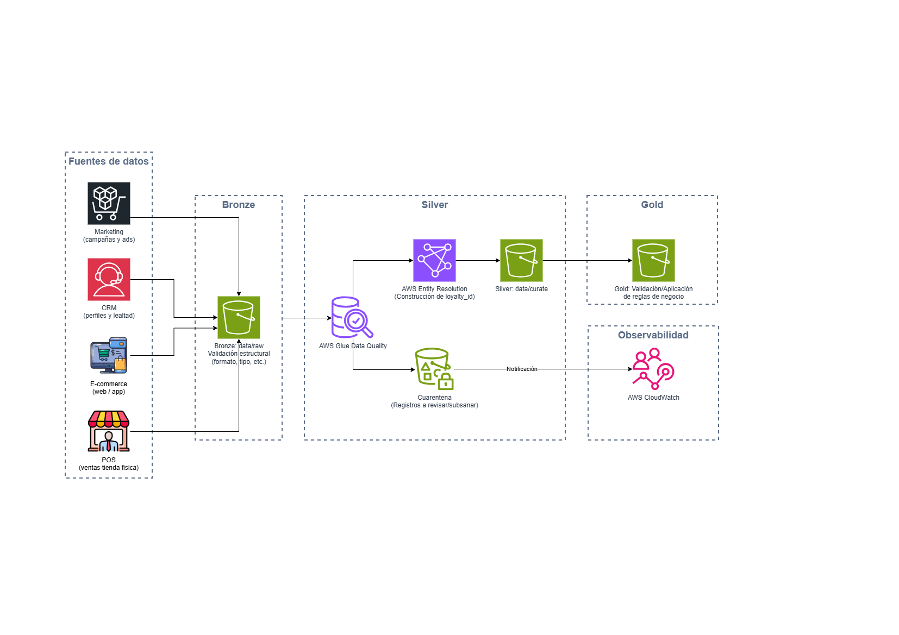

# 2. Manejo de Calidad y Consistencia de Datos

## Preguntas a responder en este bloque

2.1. ¿Cómo manejarías la calidad y la consistencia de los datos con
fuentes tan diversas? Describe las estrategias que implementarías.

2.2. ¿Qué herramientas o enfoques utilizarías para la limpieza y
transformación de datos?

## Diagrama de flujo de calidad

Versión editable en [`diagramas/02-calidad-consistencia-datos.drawio`](diagramas/02-calidad-consistencia-datos.drawio).

## 2.1. Estrategias de calidad y consistencia

El reto de este caso no es que falte calidad dentro de cada fuente
(POS, e-commerce, CRM y marketing probablemente son consistentes puertas
adentro), sino que las cuatro fuentes no comparten un mismo identificador
de cliente ni un mismo formato. Apoyo la estrategia en las capas Bronze,
Silver y Gold ya definidas en el Bloque 1, aplicando controles distintos
en cada una.

- **Contrato de datos por fuente en la ingesta.** Antes de aterrizar
  cada fuente en Bronze, registro el esquema esperado (campos, tipos,
  formato) en AWS Glue Data Catalog. Esto no bloquea nada en Bronze, pero
  me permite detectar de inmediato si una fuente cambia su estructura sin
  avisar, algo frecuente cuando CRM o Marketing son plataformas SaaS,
  Software as a Service, administradas por el proveedor y no por el
  cliente. Punto a validar con el cliente: qué tan seguido cambian de
  proveedor o de versión estas plataformas, para dimensionar qué tan
  estrictos deben ser los contratos de datos.

- **Validación progresiva por capa, no un único filtro al final.** En
  Bronze solo valido forma (formato, tipos de dato), nunca contenido de
  negocio, porque Bronze es el respaldo del dato tal cual llegó. En
  Silver aplico las reglas de negocio: completitud de campos clave,
  unicidad, formatos estandarizados (fechas, monedas, teléfonos) y
  validez de dominio (por ejemplo, un código postal que exista). Los
  registros que no cumplen no detienen todo el proceso: los separo a una
  zona de cuarentena y dejo que el resto siga su curso. En Gold valido a
  nivel agregado, por ejemplo que `customer_360` no tenga registros
  huérfanos o que `campaign_performance` cuadre con lo que reporta la
  plataforma de marketing.

- **Resolución de identidad como eje de la consistencia entre fuentes.**
  El `loyalty_id` que ya definí en el Bloque 1 no aparece solo por
  mapear un campo; lo construyo. Primero intento un cruce determinístico
  por campos exactos (correo, teléfono, número de tarjeta de lealtad), y
  solo cuando esos campos no coinciden o faltan recurro a un cruce por
  similitud (nombre y dirección, tolerando errores de tipeo o formato).
  Punto a validar con el cliente: qué campo usa hoy cada sistema como
  identificador de cliente, porque de eso depende qué tan determinístico
  puede ser el cruce desde el día uno.

- **Frescura como parte de la calidad, no solo el contenido.** Si una
  fuente no llega a tiempo, no publico el dato de ese día con huecos
  silenciosos: lo marco como incompleto y genero una alerta, apoyándome
  en el monitoreo de CloudWatch y Glue Data Quality ya definido para
  observabilidad. Punto a validar con el cliente: qué tablas o campos
  considera críticos para detener la publicación diaria de
  `customer_360` frente a cuáles pueden llegar tarde sin frenar el resto
  del pipeline.

## 2.2. Herramientas y enfoques para limpieza y transformación

- **AWS Glue Data Quality**, con reglas escritas en DQDL (Data Quality
  Definition Language). Es el motor de validación de AWS integrado
  directamente en Glue Data Catalog y en los mismos Glue Jobs que ya uso
  para transformar Bronze a Silver. Lo elegí porque no agrega una
  herramienta nueva al stack: las reglas de calidad corren como parte
  del mismo job de transformación. Segunda opción: Great Expectations,
  una herramienta de validación de datos de código abierto, preferible
  si el equipo del cliente quiere que las reglas de calidad vivan como
  código versionado independiente de AWS, por ejemplo si a futuro se
  necesita portabilidad multi-nube.

- **AWS Entity Resolution.** Servicio administrado de AWS diseñado
  específicamente para identificar y vincular registros del mismo
  cliente entre distintas fuentes, combinando reglas determinísticas y
  de machine learning sin necesidad de exponer más PII (información de
  identificación personal) de la necesaria. Lo elegí para construir el
  `loyalty_id` porque resuelve exactamente el problema central del caso:
  unificar la identidad de un cliente entre POS, e-commerce, CRM y
  marketing. Segunda opción: una lógica de emparejamiento hecha a medida
  dentro de los mismos Glue Jobs, con librerías de coincidencia difusa;
  la usaría solo si el volumen de clientes es pequeño y no justifica el
  costo de un servicio administrado, o si las reglas de negocio para
  decidir cuándo dos registros son la misma persona son muy específicas
  del cliente. Punto a validar con el cliente: qué campos usa hoy cada
  sistema para identificar a un cliente, para configurar las reglas de
  emparejamiento correctas desde el inicio.

- **AWS Glue Jobs (PySpark)**, ya definidos en el Bloque 1 como motor de
  procesamiento. Aquí les doy el rol de limpieza propiamente dicha:
  estandarizo formatos (fechas, monedas, unidades), elimino duplicados
  exactos, y normalizo texto (mayúsculas y minúsculas, tildes, espacios)
  antes de que el dato pase por Entity Resolution, para que el
  emparejamiento de identidad trabaje sobre datos ya limpios y no sobre
  variaciones de formato que no son diferencias reales entre clientes.

## Conexión con la misión de IWCO

Al manejar la calidad como un flujo de validación progresivo por capas,
en vez de un único filtro final, hago que la fase de Refinamiento de la
metodología de IWCO sea confiable: los datos no llegan a marketing y
operaciones "porque ya pasaron por el pipeline", sino porque cada capa
deja explícito qué se validó, qué se separó y por qué. Eso es lo que
sostiene la promesa de una vista única del cliente: sin resolución de
identidad confiable entre POS, e-commerce, CRM y marketing, el
`customer_360` sería solo una unión de tablas, no una vista real del
cliente.
