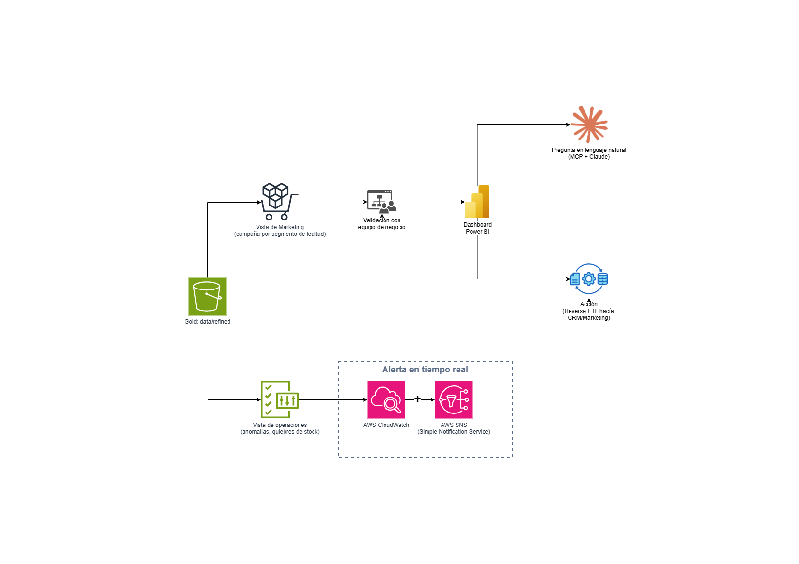

# 3. Generación de Insights

## Preguntas a responder en este bloque

3.1. ¿Cómo garantizarías que el equipo del cliente pueda utilizar y
entender los insights generados a partir de los datos consolidados?

3.2. Describe un enfoque o metodología que utilizarías para presentar los
insights de manera efectiva a los equipos de marketing y operaciones.

## Diagrama del ciclo de entrega de insights

Versión editable en [`diagramas/03-generacion-insights.drawio`](diagramas/03-generacion-insights.drawio).

## 3.1. Cómo garantizar que el equipo del cliente entienda y use los insights

Consolidar los datos en `customer_360`, `campaign_performance` y
`loyalty_attribution` (Bloque 1) no sirve de nada si el equipo de
marketing y operaciones no confía en esos números o no sabe qué hacer con
ellos. Centro la estrategia en reducir la distancia entre el dato y la
decisión, no en entregar más información.

- **Tableros diseñados por pregunta de negocio, no por métrica
  disponible.** Diseño cada tablero de Power BI para responder a una
  pregunta concreta (por ejemplo, "¿qué segmento de lealtad está en
  riesgo de dejar de comprar esta semana?"), en vez de mostrar todas las
  métricas posibles en una sola pantalla. Un tablero con treinta
  indicadores no genera comprensión, genera parálisis.

- **Glosario de negocio visible desde el propio tablero.** Documento
  cada métrica clave (por ejemplo, qué significa "tasa de abandono del
  programa de lealtad" o cómo se calcula el valor de vida del cliente)
  con una definición corta en lenguaje simple, visible como texto de
  ayuda directamente en Power BI, para que el equipo de negocio no
  dependa de alguien del equipo de datos cada vez que tiene una duda.

- **Acceso conversacional como red de seguridad, no como reemplazo del
  tablero.** Le doy al acceso vía MCP (Model Context Protocol) con
  Claude, definido en el Bloque 1, un rol puntual aquí: cuando alguien no
  entiende un número o necesita un corte que el tablero fijo no tiene,
  pregunta en lenguaje natural y obtiene respuesta al momento, en vez de
  abrir un ticket y esperar días a que el equipo de datos ajuste el
  tablero.

- **Validación con el usuario final antes de publicar, no después.**
  Antes de lanzar un tablero nuevo hago una revisión corta con quienes
  realmente lo van a usar, para ajustar el lenguaje y las
  visualizaciones a como el negocio piensa el problema, no a como el
  equipo de datos lo modeló internamente.

- **Punto a validar con el cliente:** qué tan familiarizado está hoy el
  equipo de marketing y operaciones con tableros de autoservicio, para
  calibrar cuánta capacitación inicial se necesita antes de lanzar los
  primeros entregables (profundizo esto en el Bloque 5).

## 3.2. Metodología para presentar insights a marketing y operaciones

Sigo una lógica cercana a la fase de evaluación y despliegue de CRISP-DM
(Cross Industry Standard Process for Data Mining, la metodología estándar
de la industria para proyectos de datos), pero la aplico a cómo entrego
el insight al negocio, no solo a cómo construyo el modelo.

1. **Estructura fija de cada insight: contexto, hallazgo, impacto y
   acción.** No presento ningún insight como un número suelto. Siempre
   incluyo qué pasó, qué encontré, qué representa en clientes o en
   dinero, y qué acción concreta recomiendo. Esto es justamente lo que
   el caso pide como "insight accionable": una cifra sin una acción
   asociada no cumple ese estándar.

2. **Vistas diferenciadas por rol, no un tablero único para todos.**
   Marketing necesita ver el desempeño a nivel de campaña y segmento de
   lealtad; operaciones necesita ver anomalías a nivel de tienda o
   categoría. Construyo ambas vistas sobre la misma capa Gold, pero las
   diseño por separado porque cada equipo toma decisiones distintas con
   la misma base de datos.

3. **Cadencia de entrega alineada al ciclo de decisión de cada equipo.**
   Marketing suele ajustar campañas en ciclos semanales, así que hago
   que sus reportes sigan esa cadencia. Operaciones necesita reaccionar
   más rápido ante quiebres de stock o anomalías de venta, así que ahí
   uso alertas casi en tiempo real apoyadas en la capa de streaming ya
   definida en el Bloque 1, en vez de esperar al reporte semanal.

4. **Ciclo iterativo de validación, no una entrega única.** Valido cada
   insight nuevo con el equipo de negocio antes de convertirlo en un
   tablero fijo, y reviso periódicamente si sigue siendo relevante, para
   evitar acumular tableros que nadie consulta.

5. **Cierre del ciclo con una acción real.** No dejo que el insight
   termine en la presentación: cuando aplica, lo activo mediante Reverse
   ETL (Bloque 1) hacia el CRM o la plataforma de marketing, para que la
   acción quede dentro de la herramienta donde el equipo ya trabaja
   todos los días, no como una tarea manual pendiente después de ver el
   tablero.

- **Punto a validar con el cliente:** con qué cadencia y en qué canal
  (reunión, tablero, alerta por correo o mensajería interna) prefieren
  recibir hoy este tipo de reportes marketing y operaciones, para no
  imponer un formato que no encaje con su forma de trabajar actual.

## Conexión con la misión de IWCO

Generar un insight no es el final del trabajo de datos, es el punto donde
ese trabajo se vuelve visible para el negocio. Al diseñar cada tablero
alrededor de una pregunta concreta, diferenciar las vistas por equipo y
cerrar el ciclo con una acción real, hago que la fase de Consumo de la
metodología de IWCO deje de ser solo "entregar un dashboard" y se
convierta en la toma de decisiones informada que la empresa necesita para
dejar de operar con datos fragmentados.
