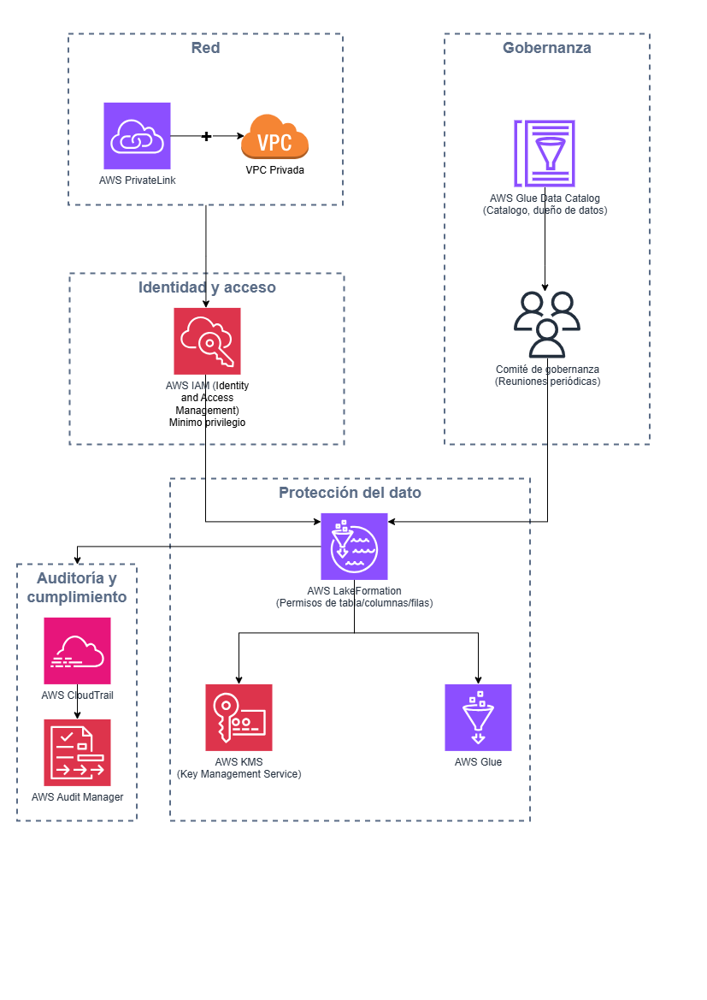

# 4. Seguridad y Gobernanza de Datos

## Preguntas a responder en este bloque

4.1. ¿Qué medidas implementarías para asegurar la privacidad y seguridad
de los datos del cliente en este nuevo sistema?

4.2. Explica cómo establecerías una estrategia de gobernanza de datos
para asegurar la calidad y el cumplimiento normativo.

## Diagrama de capas de seguridad y gobernanza

Versión editable en [`diagramas/04-seguridad-gobernanza.drawio`](diagramas/04-seguridad-gobernanza.drawio).

## 4.1. Medidas de privacidad y seguridad

No resuelvo la seguridad con un solo control, sino con capas
independientes que siguen aplicando aunque una falle. Apoyo estas capas
directamente en los servicios ya definidos en el Bloque 1.

- **Identidad y acceso de mínimo privilegio.** Uso AWS IAM (Identity and
  Access Management) con roles separados por función, ingestión,
  procesamiento, analistas de negocio, administradores, en vez de
  usuarios compartidos con permisos amplios. Cada rol accede solo a lo
  que necesita para su trabajo. Segunda opción: si el cliente ya tiene un
  directorio corporativo propio, por ejemplo Active Directory o Azure AD,
  lo integraría con AWS IAM Identity Center para centralizar identidades
  en vez de duplicar usuarios dentro de AWS.

- **Cifrado en reposo y en tránsito.** Cifro con AWS KMS (Key Management
  Service) los datos guardados en S3 y Redshift, y protejo todo el
  tráfico entre servicios con TLS (Transport Layer Security). Punto a
  validar con el cliente: si alguna normativa de su sector exige que sea
  el propio cliente quien administre las llaves de cifrado, en cuyo caso
  usaría llaves administradas por el cliente en KMS en vez de llaves
  administradas por AWS.

- **Control de acceso a nivel de dato, no solo de sistema.** Con AWS
  Lake Formation, ya definido en el Bloque 1, doy permisos a nivel de
  tabla, columna y fila. Esto es lo que permite que un analista de
  marketing vea segmentos y campañas sin poder ver el número de
  documento de un cliente puntual, en vez de un control de todo o nada
  sobre la base de datos completa.

- **Enmascaramiento y minimización de PII (información de
  identificación personal).** Como ya definí en los Bloques 1 y 2,
  enmascaro los campos sensibles (documento, teléfono, dirección) en la
  capa Silver antes de que lleguen a analistas o herramientas de
  marketing, y restrinjo el acceso al dato sin enmascarar a un rol muy
  reducido. Segunda opción: tokenización reversible en vez de
  enmascaramiento irreversible, preferible si el negocio necesita
  reconstruir el dato original en casos puntuales, por ejemplo atención
  al cliente.

- **Aislamiento de red.** Corro los servicios de procesamiento y
  análisis dentro de una VPC (Virtual Private Cloud) privada, con AWS
  PrivateLink para que el tráfico entre Glue, Redshift y S3 no salga a
  internet público. Punto a validar con el cliente: si sus equipos de
  marketing y operaciones acceden a los tableros desde fuera de la red
  corporativa, para definir cómo se exponen de forma segura sin abrir el
  data lake directamente.

- **Auditoría y trazabilidad.** Registro con AWS CloudTrail quién
  accedió a qué dato y cuándo, lo que me permite responder preguntas de
  cumplimiento como quién consultó el dato de un cliente específico en
  un periodo determinado.

- **Punto a validar con el cliente:** qué marco regulatorio le aplica en
  concreto. Si opera en Colombia, la Ley 1581 de 2012 de protección de
  datos personales y su reglamentación son el punto de partida; si
  también opera en otros países, podrían sumarse normativas adicionales
  (por ejemplo el GDPR, General Data Protection Regulation, el
  reglamento europeo de protección de datos), lo que cambia plazos de
  eliminación de datos y requisitos de consentimiento.

## 4.2. Estrategia de gobernanza de datos

La gobernanza aquí no es un documento que se firma una vez, la planteo
como un proceso que se sostiene en el tiempo apoyado en las mismas
herramientas técnicas ya definidas.

1. **Catálogo de datos como fuente única de verdad.** Extiendo AWS Glue
   Data Catalog, ya usado para metadatos en el Bloque 1, con dueños de
   datos por dominio (por ejemplo, el equipo de CRM es dueño de los
   datos de perfil de cliente), definiciones de negocio documentadas (el
   mismo glosario del Bloque 3) y una clasificación de sensibilidad por
   campo: público, interno, confidencial o PII.

2. **Responsables de calidad por dominio de datos.** No implica crear un
   cargo nuevo desde cero: propongo que sea parte del equipo de datos
   del cliente, con la capacitación específica que detallo en el Bloque
   5, encargado de revisar las reglas de calidad de Glue Data Quality
   (Bloque 2) y de aprobar cambios de esquema antes de que rompan algo
   corriente abajo.

3. **Ritual de gobernanza recurrente, no un documento estático.**
   Propongo una reunión periódica, por ejemplo mensual, entre el equipo
   de datos, negocio y seguridad para revisar incidentes de calidad,
   solicitudes de nuevos accesos y cambios normativos. La gobernanza que
   solo vive en un documento inicial deja de reflejar la realidad a los
   pocos meses.

4. **Cumplimiento normativo como proceso continuo.** Mapeo qué campos
   son PII bajo la normativa aplicable, defino políticas de retención y
   eliminación, por ejemplo cuando un cliente ejerce su derecho a que se
   elimine su información, y las implemento técnicamente con reglas de
   ciclo de vida en S3 y procesos definidos para anonimizar o borrar en
   Silver y Gold cuando corresponde.

5. **Métricas de gobernanza visibles, no solo declarativas.** Propongo
   un tablero de gobernanza, que puede vivir en el mismo Power BI, que
   muestre el estado de calidad por fuente, cuántos registros están en
   cuarentena y qué accesos se concedieron o revocaron, para que la
   gobernanza se pueda medir y no solo se dé por hecho que funciona.

6. **AWS Audit Manager**, que uso como herramienta complementaria a
   CloudTrail: organiza la evidencia de auditoría contra un marco
   normativo específico, útil cuando el cliente necesita demostrar
   cumplimiento de forma formal ante un regulador o un cliente
   corporativo propio, y no solo tener los registros técnicos
   disponibles.

- **Punto a validar con el cliente:** si ya cuenta con un oficial de
  protección de datos o un equipo legal o de cumplimiento designado,
  para que esta gobernanza técnica se conecte con ese rol desde el
  diseño, en vez de operar por separado sin coordinación.

## Conexión con la misión de IWCO

No trato la seguridad y la gobernanza como un capítulo aparte de la
arquitectura, sino como la condición para que el cliente confíe en
consolidar sus cuatro fuentes en un solo lugar. Sin control de acceso a
nivel de dato ni enmascaramiento de PII, la vista única del cliente que
resuelve la fragmentación descrita en el caso sería, al mismo tiempo, una
mayor exposición de información sensible. Al diseñar esto en capas
explícitas, con puntos de validación concretos en vez de asumir
cumplimiento, traduzco el valor de Integridad de IWCO en decisiones de
arquitectura reales.
