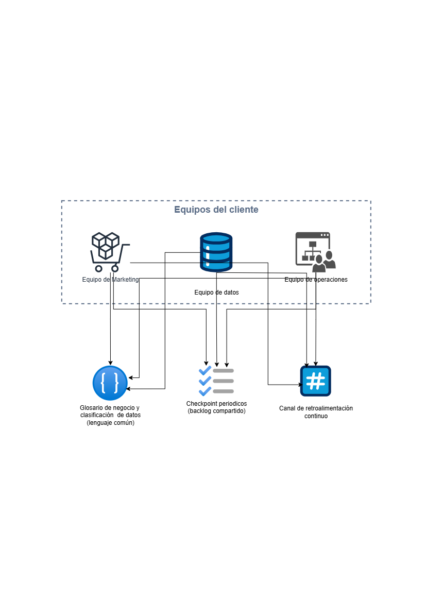

# 5. Capacitación y Desarrollo

## Preguntas a responder en este bloque

5.1. ¿Qué tipo de capacitación ofrecerías al equipo del cliente para
asegurarte de que puedan manejar y analizar los datos de manera
efectiva?

5.2. ¿Cómo fomentarías un entorno de colaboración entre los equipos de
datos, marketing y operaciones?

## Diagrama de capacitación y colaboración

Versión editable en [`diagramas/05-capacitacion-desarrollo.drawio`](diagramas/05-capacitacion-desarrollo.drawio).

## 5.1. Tipo de capacitación

Una capacitación genérica de "cómo usar Power BI" no resuelve el problema
real: lo que necesita el equipo del cliente es saber usar sus propios
tableros y su propio dato, no la herramienta en abstracto. Apoyo esta
propuesta en mi experiencia real dictando este tipo de formación como
consultor de BI y docente de datos, y la organizo en tres niveles.

- **Capacitación diferenciada por rol, no un curso único para todos.**
  Al equipo de datos del cliente le doy formación técnica profunda en
  las herramientas del stack, Glue, Redshift, Lake Formation y Glue Data
  Quality, para que puedan mantener y extender el pipeline sin depender
  permanentemente de IWCO. A los analistas de marketing y operaciones
  les doy formación de autoservicio en Power BI, orientada a navegar y
  filtrar los tableros ya construidos, no a construir pipelines.

- **Talleres sobre casos reales del negocio, no sobre la herramienta en
  abstracto.** En vez de un curso genérico de Power BI, construyo los
  talleres directamente sobre `customer_360` y `campaign_performance`,
  los tableros que el equipo va a usar en su día a día. Lo aprendido
  sobre el propio dato real se queda mucho más que lo aprendido sobre
  datos de ejemplo genéricos.

- **Tres niveles progresivos de formación.** Fundamentos, qué significa
  cada tablero y cada métrica, conectado directamente al glosario de
  negocio del Bloque 3. Autoservicio, cómo filtrar, exportar y preguntar
  al acceso conversacional MCP (Model Context Protocol) con Claude del
  Bloque 1 en vez de esperar un ticket. Avanzado, para quienes asuman el
  rol de responsables de calidad de datos del Bloque 4, cómo interpretar
  una alerta de calidad y cuándo escalarla.

- **Material de referencia, no solo una sesión en vivo.** Una sesión en
  vivo se olvida en un par de semanas. La complemento con guías cortas y
  grabaciones de referencia para que el equipo pueda resolver dudas por
  su cuenta después de la capacitación inicial, sin depender de la
  memoria de esa primera sesión.

- **Punto a validar con el cliente:** quiénes son en concreto las
  personas de cada equipo que van a usar cada nivel de capacitación, para
  no formar a todo marketing en lo mismo cuando dentro del equipo hay
  roles distintos con necesidades distintas.

## 5.2. Cómo fomentar la colaboración entre datos, marketing y operaciones

Como Scrum Master certificado, considero que la forma más efectiva de
lograr esto no es una política de colaboración escrita, sino rituales
concretos y ligeros que hagan que datos, marketing y operaciones trabajen
en el mismo ciclo, en vez de que unos sean "clientes" de los otros.

- **Un backlog compartido, no tres listas separadas de pendientes.**
  Pongo las solicitudes de datos, los ajustes a tableros y las nuevas
  reglas de calidad en un mismo backlog visible para los tres equipos,
  con prioridades revisadas en conjunto, en vez de que cada equipo pida
  cosas por su lado sin visibilidad de lo que los otros están esperando.

- **Checkpoints cortos y periódicos entre los tres equipos.** Propongo
  un encuentro breve, por ejemplo quincenal, no una ceremonia larga,
  donde reviso qué se entregó, qué está pendiente y qué cambió en las
  prioridades del negocio. Mi meta es que sea corto y útil, no que se
  convierta en otra reunión que nadie quiere tener.

- **Lenguaje común antes que herramientas comunes.** Uso el glosario
  del Bloque 3 y la clasificación de datos del Bloque 4 como algo más
  que documentación técnica: son lo que evita que "cliente activo"
  signifique una cosa distinta para marketing, operaciones y el equipo
  de datos. Sin ese acuerdo previo, cualquier tablero compartido genera
  discusiones sobre números en vez de decisiones.

- **Canal de retroalimentación continuo, no solo la capacitación
  inicial.** Habilito un canal claro donde marketing u operaciones
  puedan avisar que un dato no cuadra o pedir un ajuste a un tablero,
  con un tiempo de respuesta definido, en vez de depender de mensajes
  sueltos o de encontrarse por pasillo con alguien del equipo de datos.

- **Diseño conjunto en los momentos que importan.** Al crear un tablero
  nuevo, en la validación con el usuario final del Bloque 3, o al
  definir una regla de calidad nueva del Bloque 2, incluyo a la persona
  de negocio desde el inicio, en vez de tratarlo como una entrega que el
  equipo de datos hace al final sin haber consultado a nadie.

- **Punto a validar con el cliente:** cómo están organizados hoy estos
  tres equipos, si ya existe algún ritual conjunto o si cada uno opera
  por su lado, para no imponer una cadencia de colaboración que no
  encaje con la forma en que ya trabajan.

## Conexión con la misión de IWCO

Un pipeline bien construido no genera valor si el equipo del cliente no
sabe usarlo, o si datos, marketing y operaciones siguen trabajando en
silos separados. Al capacitar sobre el dato real del cliente, no sobre la
herramienta en abstracto, y al sostener la colaboración con rituales
concretos en vez de una política escrita, hago que la fase de Consumo de
la metodología de IWCO le quede al cliente, sin que dependa de que IWCO
siga presente para que el sistema funcione.
