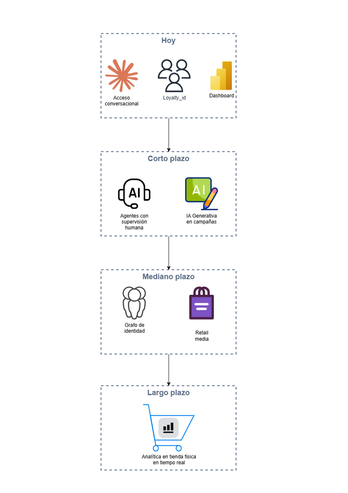

# 6. Tendencias y Futuro

## Preguntas a responder en este bloque

6.1. Considerando el contexto del cliente, ¿qué tendencias emergentes en
el análisis de datos crees que podrían beneficiar a su negocio en el
futuro?

6.2. ¿Cómo te mantendrás actualizado sobre las nuevas tecnologías y
enfoques en el campo de datos?

## Diagrama de ruta de tendencias

Versión editable en [`diagramas/06-tendencias-futuro.drawio`](diagramas/06-tendencias-futuro.drawio).

## 6.1. Tendencias emergentes relevantes para este negocio

No todas las tendencias del momento aplican a este cliente. Las que
sigo aquí las seleccioné porque construyen directamente sobre lo que ya
definí en los bloques anteriores, no porque sean populares.

- **IA agéntica con supervisión humana para personalización en tiempo
  real.** El acceso conversacional vía MCP (Model Context Protocol) con
  Claude, ya definido en el Bloque 1, es el primer paso. El siguiente es
  que esos agentes no solo respondan preguntas sino que ejecuten acciones
  puntuales, por ejemplo ajustar el presupuesto de una campaña que no
  está funcionando, siempre con aprobación humana antes de ejecutar el
  cambio, nunca de forma autónoma. Punto a validar con el cliente: qué
  tan cómodo está el negocio con que un agente proponga acciones
  concretas, aunque la decisión final la tome siempre una persona.

- **Modelos generativos aplicados a la ejecución de campañas, no solo al
  análisis.** Hoy los modelos predictivos del Bloque 1 identifican a qué
  segmento ofrecerle algo. El siguiente paso es que un modelo generativo
  ayude a redactar el contenido de esa oferta, por ejemplo el texto de un
  correo personalizado, conectando el insight con la ejecución de
  marketing en un solo paso en vez de dos equipos separados.

- **Monetización del dato propio del cliente (first-party data).** Con la
  desaparición progresiva de las cookies de terceros, el dato que esta
  arquitectura ya consolida se vuelve un activo valioso. Cadenas grandes
  de retail han empezado a ofrecer espacio publicitario a sus propias
  marcas y proveedores basado en el comportamiento real de sus clientes
  leales, lo que abre una fuente de ingreso adicional construida sobre la
  misma infraestructura de datos que propongo aquí.

- **Grafos de identidad más allá de un único `loyalty_id`.** El
  `loyalty_id` que definí en el Bloque 1 resuelve identificar a un
  cliente entre cuatro fuentes. El siguiente nivel es un grafo de
  identidad que además conecte dispositivos y comportamiento offline y
  online de forma más rica, útil a medida que el cliente sume más
  canales de contacto.

- **Analítica en tienda física (edge).** Hoy el comportamiento offline
  solo se ve a través de lo que el POS registra al momento de pagar.
  Sensores o cámaras con analítica local, sin identificar personas, solo
  patrones de tráfico y flujo dentro de la tienda, cerrarían la brecha
  con el nivel de detalle que ya existe del lado digital.

- **Punto a validar con el cliente:** cuáles de estas tendencias
  encajan con su apetito de inversión actual. No propondría las cinco a
  la vez; el orden lógico es primero extender lo que ya se aprobó,
  agentes y generación de contenido, antes de considerar inversiones
  mayores como sensores en tienda.

## 6.2. Cómo me mantengo actualizado en tecnologías y enfoques de datos

Mantenerme actualizado no es leer noticias de IA en general, es seguir de
cerca específicamente las herramientas que ya están en esta arquitectura y
las alianzas reales con las que trabaja IWCO.

- **Aprendizaje estructurado en la nube, no solo lectura pasiva.** Tomo
  certificaciones y rutas de AWS específicas de datos e inteligencia
  artificial, con la misma disciplina con la que ya certifiqué mi
  experiencia previa como Data Engineer en AWS, para no quedar
  desactualizado justo en los servicios que estoy recomendando aquí.

- **Seguimiento directo de las fuentes, no de intermediarios.** Sigo
  anuncios de producto y notas técnicas de AWS re:Invent, blogs
  oficiales de datos y machine learning de AWS, y las novedades de
  Databricks, en vez de depender solo de resúmenes de terceros que
  llegan varias semanas tarde.

- **Comunidad técnica y práctica aplicada.** Participo en comunidades
  locales de datos en Colombia y aplico lo nuevo en proyectos reales o
  en laboratorios propios, porque una tecnología solo se entiende de
  verdad cuando se usa, no cuando se lee sobre ella.

- **Mantener la práctica docente como mecanismo de actualización.** Dar
  formación, como ya lo he hecho como docente de datos, me obliga a
  entender un tema a fondo para poder explicarlo y responder preguntas,
  lo cual es en sí mismo una forma exigente de mantenerme al día.

- **Revisión periódica del panorama multi-nube.** Como la industria y
  consultoras como IWCO trabajan con AWS, Azure, GCP y Databricks a la
  vez, mantenerme actualizado también implica comparar activamente cómo
  evolucionan esas alternativas, para poder recomendar con criterio
  actualizado en vez de repetir siempre la misma solución aprendida una
  vez.

## Conexión con la misión de IWCO

Ninguna de estas tendencias tiene sentido si la propongo antes de que la
base esté sólida. Por eso este bloque cierra donde empecé el Bloque 1: la
arquitectura, la calidad, los insights, la seguridad y la capacitación que
ya definí son la condición para que el cliente pueda aprovechar lo que
viene después. Mantenerme actualizado, para IWCO y para mí al liderar esta
solución, no es una tarea aparte del trabajo técnico, es lo que sostiene en
el tiempo la promesa de simplificar el aprovechamiento del dato mediante
procesos automatizados que apalanquen decisiones informadas.
